# MIRNet

[](https://share.streamlit.io/soumik12345/mirnet/app.py)

Tensorflow implementation of the MIRNet architecture as proposed by [Learning Enriched Features for Real Image
Restoration and Enhancement](https://arxiv.org/pdf/2003.06792v2.pdf).

**Lanuch Notebooks:** [](https://mybinder.org/v2/gh/soumik12345/MIRNet/HEAD)

**Wandb Logs:** [https://wandb.ai/19soumik-rakshit96/mirnet](https://wandb.ai/19soumik-rakshit96/mirnet)

**TFLite Variant of MIRNet:** [https://github.com/sayakpaul/MIRNet-TFLite](https://github.com/sayakpaul/MIRNet-TFLite).

**TFLite Models on Tensorflow Hub:** [https://tfhub.dev/sayakpaul/lite-model/mirnet-fixed/dr/1](https://tfhub.dev/sayakpaul/lite-model/mirnet-fixed/dr/1).

**Tensorflow JS Variant of MIRNet:** [https://github.com/Rishit-dagli/MIRNet-TFJS](https://github.com/Rishit-dagli/MIRNet-TFJS).


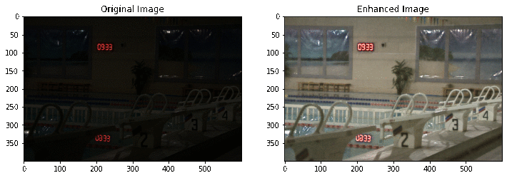

## Result of Low-Light Image Enhancement

### Trained on 128x128 patches

**Wights Link:** [https://drive.google.com/file/d/1sUlRD5MTRKKGxtqyYDpTv7T3jOW6aVAL/view?usp=sharing](https://drive.google.com/file/d/1sUlRD5MTRKKGxtqyYDpTv7T3jOW6aVAL/view?usp=sharing)

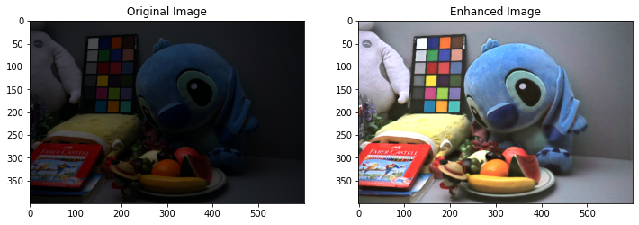
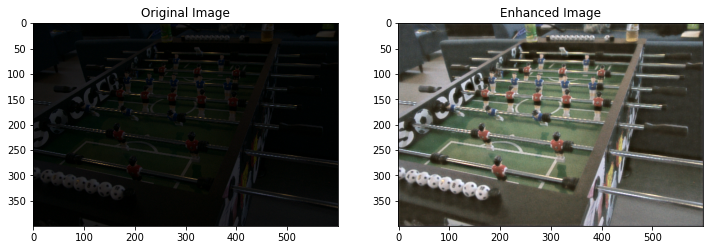
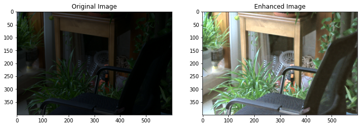


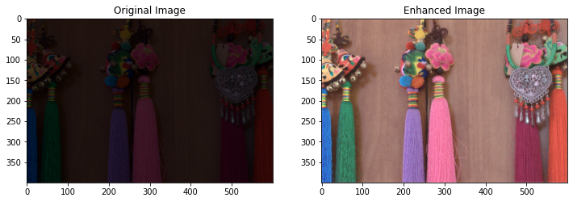

### Trained on 256x256 patches

**Wights Link:** [https://drive.google.com/file/d/1sUlRD5MTRKKGxtqyYDpTv7T3jOW6aVAL/view?usp=sharing](https://drive.google.com/file/d/1sUlRD5MTRKKGxtqyYDpTv7T3jOW6aVAL/view?usp=sharing)

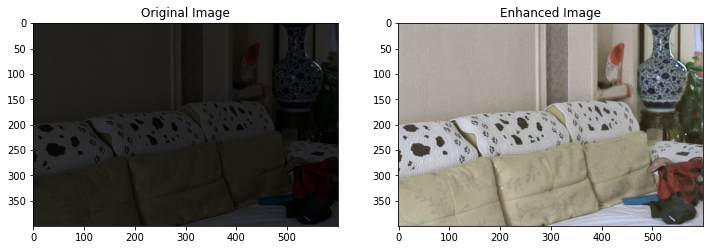
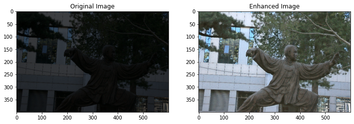
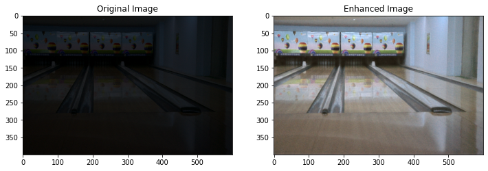
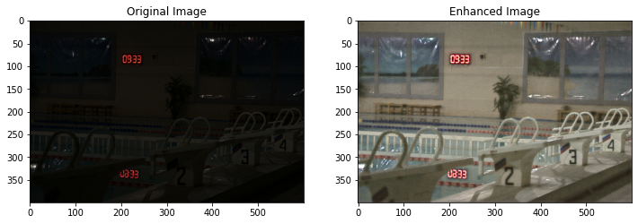
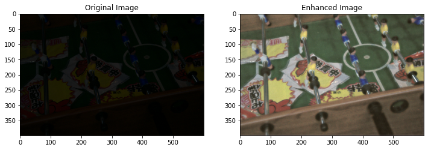
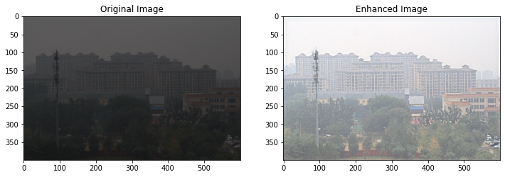
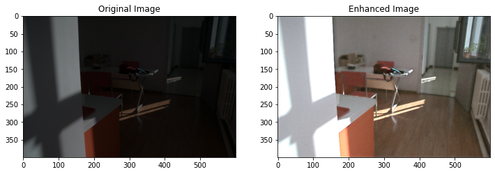

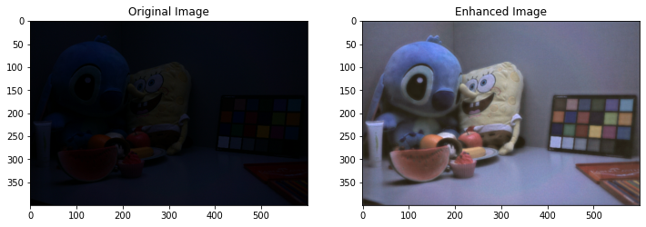

## Citation

```
@misc{
    2003.06792,
    Author = {Syed Waqas Zamir and Aditya Arora and Salman Khan and Munawar Hayat and Fahad Shahbaz Khan and Ming-Hsuan Yang and Ling Shao},
    Title = {Learning Enriched Features for Real Image Restoration and Enhancement},
    Year = {2020},
    Eprint = {arXiv:2003.06792},
}
```
