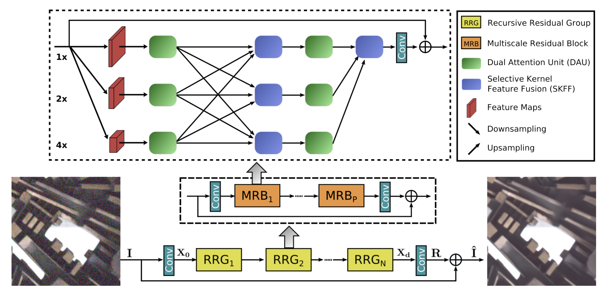

# MIRNet

Tensorflow implementation of the MIRNet architecture as proposed by [Learning Enriched Features for Real Image
Restoration and Enhancement](https://arxiv.org/pdf/2003.06792v2.pdf).

**Lanuch Notebooks:** [](https://mybinder.org/v2/gh/soumik12345/MIRNet/HEAD)

**Wandb Logs:** [https://wandb.ai/19soumik-rakshit96/mirnet](https://wandb.ai/19soumik-rakshit96/mirnet)



## Citation

```
@misc{
    2003.06792,
    Author = {Syed Waqas Zamir and Aditya Arora and Salman Khan and Munawar Hayat and Fahad Shahbaz Khan and Ming-Hsuan Yang and Ling Shao},
    Title = {Learning Enriched Features for Real Image Restoration and Enhancement},
    Year = {2020},
    Eprint = {arXiv:2003.06792},
}
```
